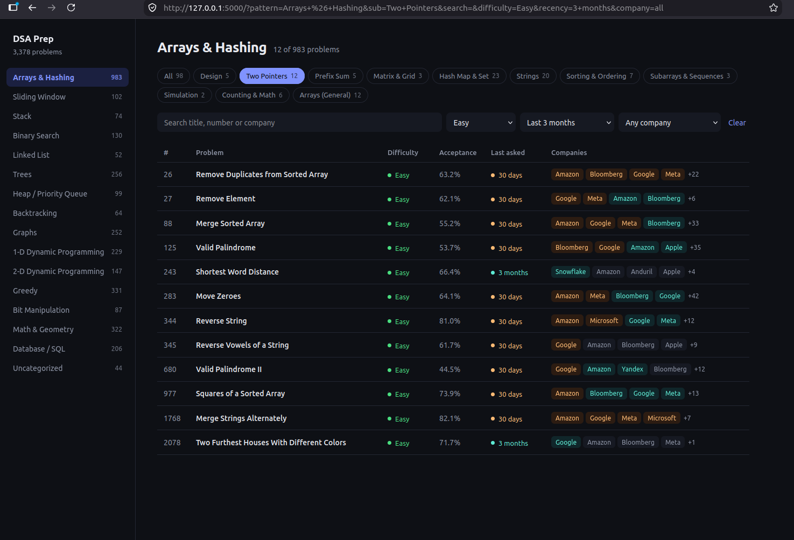
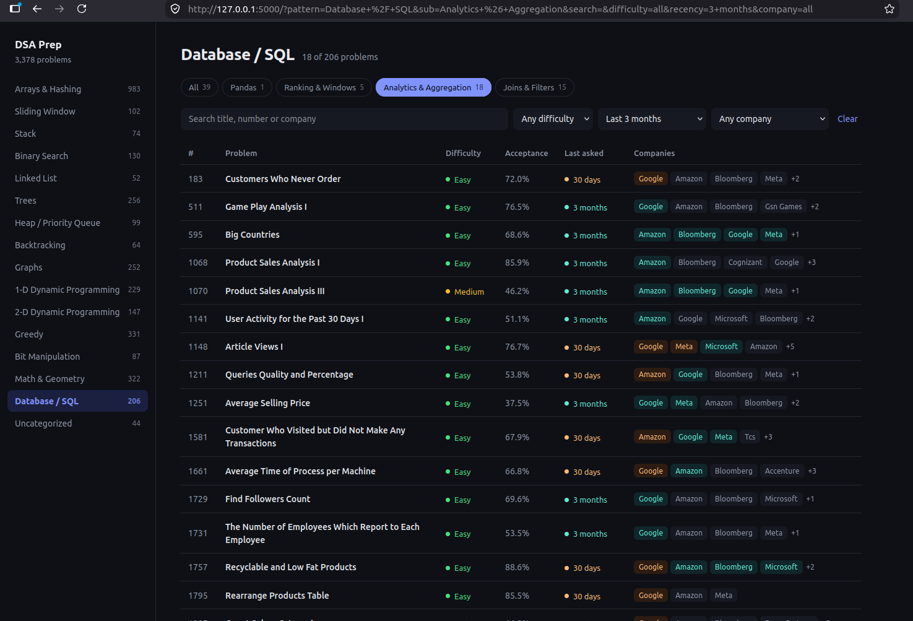

# DSA Prep Tracker

A small, fast web app for interview prep. Browse 3,300+ coding problems by topic and sub-topic, and see which companies ask them and how recently.




## Features

- **16 topics, with sub-topics.** Big topics are split into focused groups. For example, *Arrays & Hashing* becomes Two Pointers, Hash Map & Set, Prefix Sum, Strings and more.
- **Company and recency tags.** See who asked a problem, and whether it was in the last 30 days, 3 months or 6 months.
- **Filters that combine.** Search by title, number or company. Filter by difficulty, recency and company.
- **Light and dark mode.** It follows your system setting.

## Quick start

Requires Python 3.10 or newer.

```bash

python -m venv .venv
source .venv/bin/activate        # Windows: .venv\Scripts\activate
pip install -r requirements.txt

python app.py
```

Open <http://127.0.0.1:5000>.

## Project structure

```
dsa-tracker/
├── app.py                        Flask app: loads data, filters, routes
├── subtopics.py                  Sub-topic rules (edit this to re-group problems)
├── processed_data_fixed.json     Problem data, grouped by topic
├── templates/
│   └── index.html
├── static/
│   └── style.css
├── requirements.txt
└── .gitignore
```

## How it works

**Topics come from the JSON.** The top-level keys of `processed_data_fixed.json` are the topics. Nothing is hard-coded in the app, and the file is never modified.

Each problem looks like this:

```json
{
  "id": 15,
  "title": "3Sum",
  "url": "https://leetcode.com/problems/3sum",
  "difficulty": "Medium",
  "acceptance": "39.4%",
  "companies": [{ "name": "Google", "recency": "30 days" }],
  "recency": "30 days",
  "pattern": "Arrays & Hashing"
}
```

**Sub-topics are computed at startup** by `subtopics.py`, in this order:

1. `PINNED` maps an exact problem ID to a sub-topic.
2. `RULES` holds regexes matched against the title. The first match wins.
3. `FALLBACK` is the catch-all bucket for that topic.

To move a problem, add its ID to `PINNED`:

```python
PINNED = {
    75: "Two Pointers",   # Sort Colors
}
```

To re-group a whole family, edit the regex for that sub-topic in `RULES`. The order of the list is the order of the chips in the UI. Topics with no entry in `RULES` simply show no chips.

Sub-topics are keyword-based, so expect the odd misfile. Use `PINNED` to fix those.

## Deploy for free

The app is read-only and has no database, so any free Python host works. **Render** is the simplest.

### Render (recommended)

1. Push the project to a GitHub repo. Make sure `processed_data_fixed.json` is committed.
2. On [render.com](https://render.com), choose **New → Web Service** and connect the repo.
3. Use these settings:

   | Setting | Value |
   | --- | --- |
   | Runtime | Python 3 |
   | Build command | `pip install -r requirements.txt` |
   | Start command | `gunicorn app:app` |
   | Instance type | Free |

4. Click **Create Web Service**. You get a `https://your-app.onrender.com` URL, and every `git push` redeploys automatically.

On the free plan the service sleeps after a period of inactivity, so the first visit after a while can take up to a minute to wake it. Free-tier limits change, so check Render's current pricing page.

### Alternative: PythonAnywhere

The free plan doesn't sleep like Render's, but setup is manual: upload the files, create a virtualenv, and point a web app at `app.py` through the WSGI file. It's a good choice if you'd rather not wait for cold starts.

### Configuration

| Variable | Default | Purpose |
| --- | --- | --- |
| `PORT` | `5000` | Port for `python app.py` |
| `HOST` | `127.0.0.1` | Bind address for `python app.py` |
| `FLASK_DEBUG` | `1` | Set to `0` to turn off debug mode locally |

In production gunicorn runs the app, so these only affect `python app.py`.

## Data

Company and recency data comes from a community-maintained collection of company-wise interview questions. Problem titles and links point to LeetCode, and no problem statements are stored.

